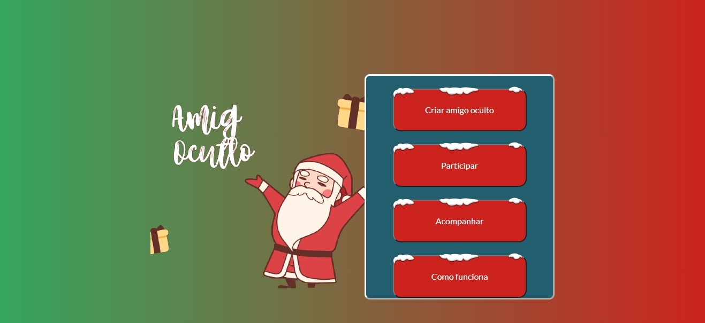

## SUMÁRIO

1. [Apresentação](#apresentacao "Apresentação")  
	1.1. Apresentação  
	1.2. O problema  
    1.3. Tecnologias utilizadas  

2. [Utilização](#utilização "Utilização")  
'	2.1. Instruções de utilização  

3. [Aplicação](#aplicação "A aplicação")  
	3.1 Print do menu inicial  

4. [Versões](#versões "Histórico de versões" )  
	4.1.1 Versão inicial 0.1.1

## 1.1 AmigOculto

O AmigOculto é uma plataforma feita para sortear amigo oculto de forma online com intuito de facilitar essa brincadeira tão tradicional. Agora pessoas que moram longe ou tem uma rotina corrida podem sortear seus amigos de uma forma rápida e fácil.

## 1.2 O problema

O problema que o projeto se dispõe a resolver é a dificuldade de se sortear pessoas na brincadeira chamada "Amigo oculto", devido que essa brincadeira exige que todas as pessoas estejam disponíveis no mesmo lugar e hora para se fazer o sorteio.

## 1.3 Tecnologias utilizadas

Nessa aplicação foi utilizada <a href="https://go.dev">GoLang</a> no back-end, HTML e CSS para gerar os templates e <a href="https://www.postgresql.org">PostgreSQL</a> como banco de dados.

## Instruções de utilização

Por enquanto não existe uma versão para utilização.

## A aplicação

## Histórico de versões

* 0.1.1
    * Versão inicial: Já é possível criar um amigo oculto e sortear alguém. Falta explicar como funciona e acompanhar amigo oculto.